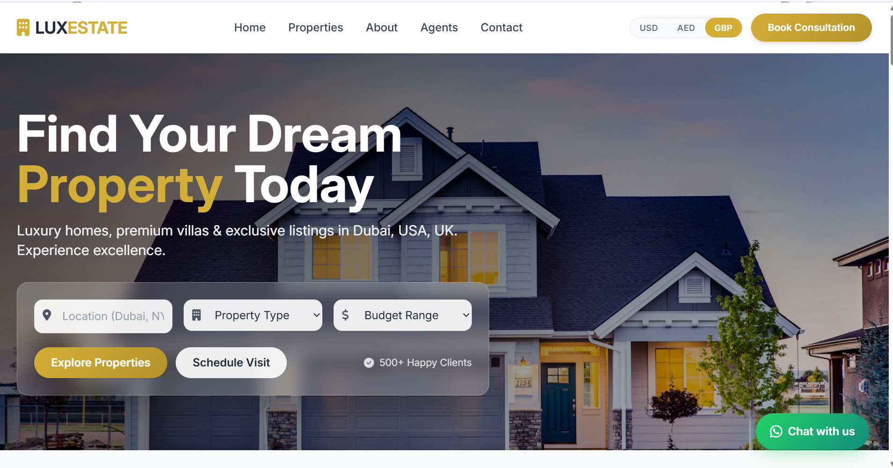
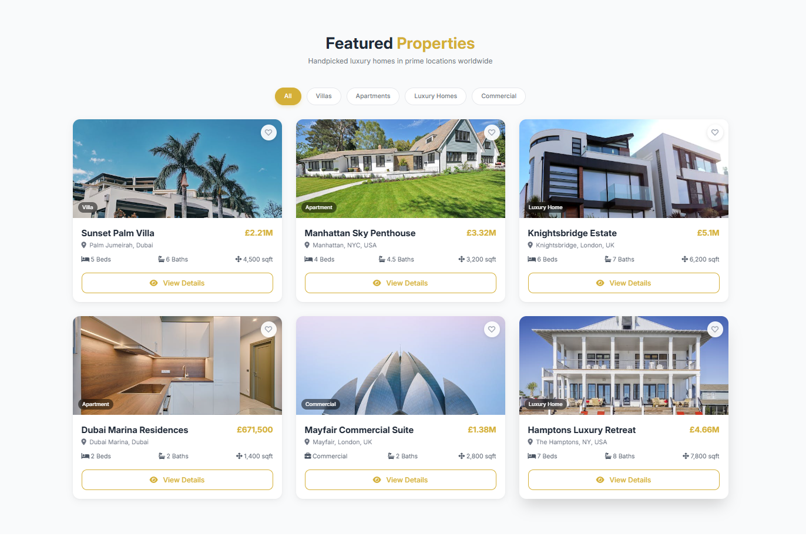
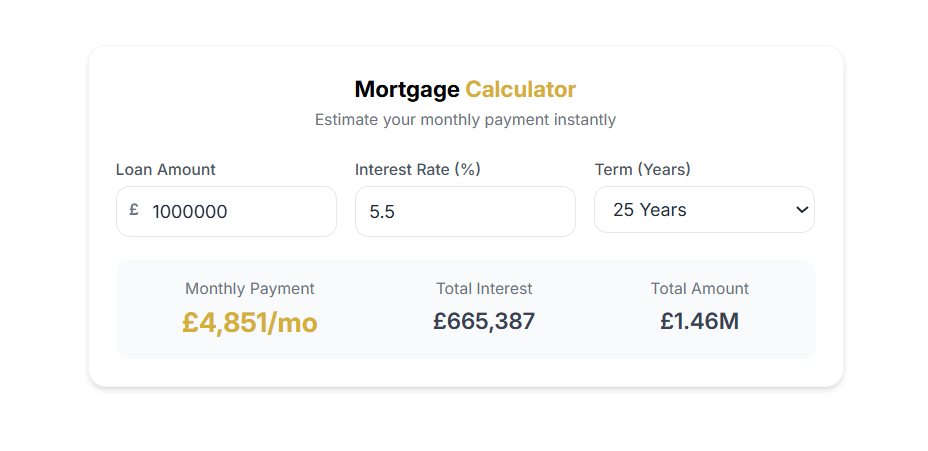
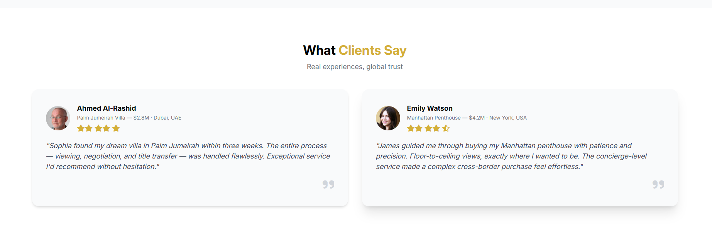
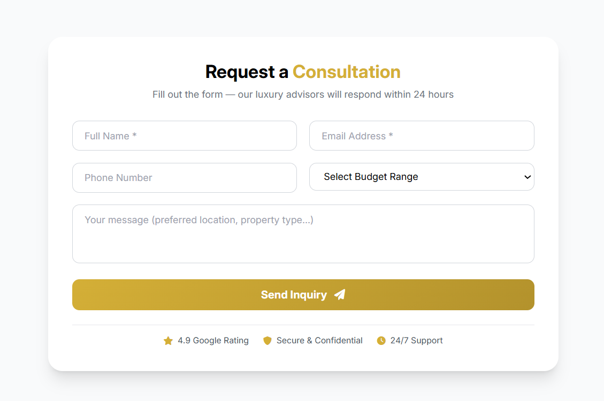
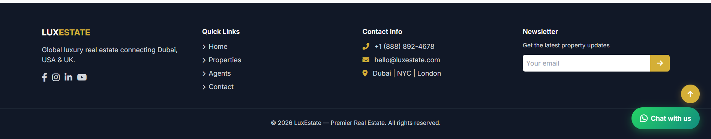

# 🏰 LuxEstate — Premium Real Estate Landing Page

A modern, fully responsive luxury real estate landing page featuring interactive property listings, multi-currency support, mortgage calculator, wishlist, animated statistics, and lead generation forms.

---

## 📋 Table of Contents

- [Screenshots](#screenshots)
- [Features](#features)
- [Technologies Used](#technologies-used)
- [File Structure](#file-structure)
- [Installation & Setup](#installation--setup)
- [Customization Guide](#customization-guide)
- [Deployment](#deployment)
- [Browser Support](#browser-support)
- [Credits](#credits)

---

## 📸 Screenshots

### 🏠 Home


### 🏘️ Properties


### ⭐ Why Choose Us


### 🗂️ Browse by Category


### 👥 Agents


### 🧮 Mortgage Calculator


### 💬 Client Testimonials


### 📋 Consultation Form


### 🦶 Footer


---

## ✨ Features

### Core Features

- ✅ **Fully Responsive Design** — Optimized for mobile, tablet, and desktop
- ✅ **Multi-Currency Switcher** — Switch between USD, AED, and GBP in real time (header and mobile menu)
- ✅ **Interactive Property Cards** — Hover effects, wishlist toggle, and quick detail access
- ✅ **Property Modal** — Full-screen popup with image, description, features, and a schedule-viewing CTA. Closes via X button, outside click, or ESC key. Full keyboard focus trap.
- ✅ **Wishlist System** — Save/unsave properties with animated toast notifications
- ✅ **Live Search & Multi-Filter** — Filter by location (debounced text input), property type, budget range, and category chip simultaneously
- ✅ **Mortgage Calculator** — Real-time monthly payment, total interest, and total amount estimates; respects active currency
- ✅ **Animated Statistics Counters** — Numbers count up when scrolled into view (IntersectionObserver + easing)
- ✅ **Market Growth Chart** — Interactive Chart.js line chart (2021–2025 avg property values)
- ✅ **Mobile Navigation Drawer** — Slide-in hamburger menu with overlay and focus management
- ✅ **Scroll Progress Bar** — Gold gradient bar at the top of the viewport
- ✅ **Back to Top Button** — Appears after 500px scroll
- ✅ **Smooth Scroll Navigation** — All anchor links scroll smoothly
- ✅ **Contact Form with Validation** — Live blur validation for name and email; success/error feedback
- ✅ **Newsletter Signup** — Email validation with inline feedback (footer)
- ✅ **WhatsApp Floating Button** — Pre-filled message link for instant consultation
- ✅ **Cookie Consent Banner** — GDPR-style banner with Accept/Decline; preference stored in localStorage
- ✅ **Accessibility** — Skip link, ARIA labels, roles, `aria-live` regions, focus-visible styles, reduced-motion support
- ✅ **SEO Ready** — Semantic HTML5, Open Graph tags, Twitter Card meta, canonical URL, robots meta

### Sections

| # | Section | Description |
|---|---------|-------------|
| 1 | **Hero** | Full-viewport background with parallax (desktop), location/type/budget search bar |
| 2 | **Featured Properties** | Filterable grid of 6 property cards |
| 3 | **Why Choose Us** | 4 feature highlights with hover-scale cards |
| 4 | **Browse by Category** | Category pill buttons that sync with the filter chips above |
| 5 | **Statistics** | Animated counters (properties sold, clients, cities, years) |
| 6 | **Market Growth Chart** | Chart.js line chart |
| 7 | **Mortgage Calculator** | Loan amount, rate, term inputs with live output |
| 8 | **Meet Our Agents** | 3 agent cards with deal count, languages, response time, social links |
| 9 | **Testimonials** | 2 client reviews with star ratings |
| 10 | **Contact / Consultation Form** | Name, email, phone, budget, message; trust badges |
| 11 | **Footer** | Quick links, contact info, social icons, newsletter signup |

---

## 🛠️ Technologies Used

| Technology | Version / Source | Purpose |
|------------|-----------------|---------|
| **HTML5** | — | Semantic markup, accessibility |
| **Tailwind CSS** | CDN (latest) | Utility-first layout & responsive design |
| **JavaScript (ES6+)** | Vanilla | All interactivity — no frameworks |
| **Chart.js** | 4.4.0 (CDN) | Market trend line chart |
| **Font Awesome** | 6.0.0-beta3 (CDN) | Icon library throughout |
| **Google Fonts** | Inter & Poppins | Typography |
| **Pexels / RandomUser** | External URLs | Demo property images & agent photos |

---

## 📁 File Structure

```
luxury-real-estate/
├── index.html   # HTML structure, sections, and markup
├── main.js      # All JavaScript — data, filters, modal, calculator, etc.
└── style.css    # Custom CSS — animations, components, responsive tweaks
```

> Tailwind CSS, Chart.js, Font Awesome, and Google Fonts are loaded via CDN. No build step or package manager is required.

---

## 🚀 Installation & Setup

### Option 1 — Open directly in browser

1. Clone or download the repository
2. Open `index.html` in any modern browser

### Option 2 — Local dev server (recommended)

```bash
# Python
python -m http.server 8000

# Node.js (npx)
npx http-server .

# VS Code — use the Live Server extension
```

Then visit `http://localhost:8000` in your browser.

> All three files (`index.html`, `main.js`, `style.css`) must be in the same directory.

---

## 🎨 Customization Guide

### Brand Color

The primary gold accent is `#d4af37`. To change it, find-and-replace across all three files:

```
#d4af37  →  your-color
#b3922c  →  your-color-dark  (hover/gradient variant)
```

Tailwind arbitrary values to update: `bg-[#d4af37]`, `text-[#d4af37]`, `border-[#d4af37]`, etc.

---

### Property Listings

Edit the `properties` array at the top of `main.js`:

```js
const properties = [
  {
    id: 1,
    title: 'Sunset Palm Villa',
    priceUSD: 2800000,          // Always in USD; currency conversion is automatic
    location: 'Palm Jumeirah, Dubai',
    city: 'dubai',              // Used for location search matching
    type: 'Villa',              // Must match a filter chip: Villa | Apartment | Luxury Home | Commercial
    budget: '1m-3m',            // 500k-1m | 1m-3m | 3m+
    beds: 5,
    baths: 6,
    sqft: 4500,
    image: 'https://...',
    description: '...',
    features: ['Feature 1', 'Feature 2'],
  },
  // ...
];
```

---

### Currency Rates

Update exchange rates in `main.js`:

```js
const CURRENCY_CONFIG = {
  USD: { symbol: '$',    rate: 1,    label: 'USD' },
  AED: { symbol: 'AED ', rate: 3.67, label: 'AED' },
  GBP: { symbol: '£',   rate: 0.79, label: 'GBP' },
};
```

To add a new currency (e.g. EUR), add an entry here and a matching `.currency-btn` button in both the desktop and mobile nav in `index.html`.

---

### Agents

Edit the three `<article class="agent-card ...">` blocks in the `#agents` section of `index.html`. Update the name, title, deal count, languages, response time, and social links.

---

### Hero Background

In `style.css`, replace the Pexels URL:

```css
.hero-section {
  background-image: url('your-image-url.jpg');
}
```

---

### WhatsApp Number

In `index.html`, update the floating button `href`:

```html
<a href="https://wa.me/YOUR_NUMBER?text=Your+message">
```

---

### Market Chart Data

In `main.js`, find `initChart()` and update the `labels` and `data` arrays:

```js
labels: ['2021', '2022', '2023', '2024', '2025'],
data: [1.2, 1.5, 1.8, 2.1, 2.6],
```

---

## 🌐 Deployment

### GitHub Pages

```bash
git init
git add .
git commit -m "Initial commit"
git remote add origin https://github.com/your-username/your-repo.git
git push -u origin main
# Enable GitHub Pages in repo Settings → Pages → Branch: main
```

### Netlify / Vercel

Drag and drop the project folder into [netlify.com/drop](https://app.netlify.com/drop) or import the repo in the Vercel dashboard. No build configuration needed.

---

## 🖥️ Browser Support

| Browser | Support |
|---------|---------|
| Chrome 90+ | ✅ Full |
| Firefox 88+ | ✅ Full |
| Safari 14+ | ✅ Full |
| Edge 90+ | ✅ Full |
| IE 11 | ❌ Not supported |

> `backdrop-filter` (glassmorphism) requires a modern browser. The layout degrades gracefully without it.

---

## 📄 Credits

- Property photos — [Pexels](https://www.pexels.com)
- Agent avatars — [RandomUser.me](https://randomuser.me)
- Icons — [Font Awesome](https://fontawesome.com)
- Charts — [Chart.js](https://www.chartjs.org)
- CSS utilities — [Tailwind CSS](https://tailwindcss.com)

---

## 📝 License

© 2026 LuxEstate. All rights reserved.
